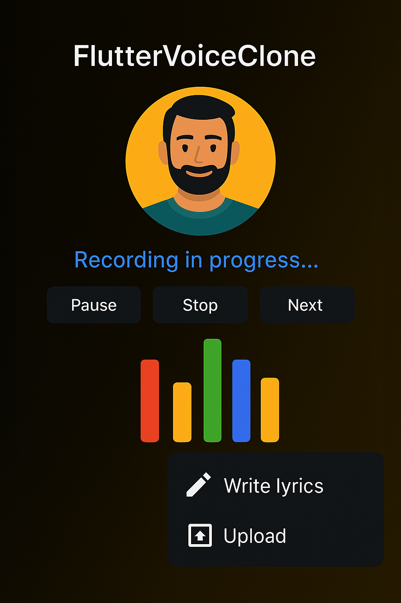

# 🧬 FlutterVoiceClone


 <!-- Replace with actual image path -->

---

## 📣 Overview

**FlutterVoiceClone** is a voice cloning and synthesis app built with Flutter for UI and Python under the hood for real-time audio processing and deep learning inference. It allows users to record their voice, match speech prompts, clone vocal features, and generate new speech using that cloned identity.

---

## 🚀 Features

- 🎙️ Record user voice with animated waveform visualizations
- 🔁 Switch between *Recording* and *Cloning* modes
- 🧠 Extract vocal features via `facebook/wav2vec2-large-960h`
- 💬 Text-to-speech synthesis using `T5-large` trained in speech-seq2seq
- ✅ Validate prompt transcription before cloning
- 🧪 Animated playback and transformation interface
- 🔐 UI gradients, feedback prompts, and floating controls

---

## 🛠 Technologies

- **Flutter** (UI interface)
- **Python**  
  - `sounddevice`, `soundfile`, `numpy`, `torch`, `transformers`, `tensorflow`
- **HuggingFace Models**  
  - [`facebook/wav2vec2-large-960h`](https://huggingface.co/facebook/wav2vec2-large-960h)  
  - [`t5-large`](https://huggingface.co/t5-large)
- **Custom Components**  
  - `AnimatedSwitcher`, `PopupMenu`, `ElevatedButton`, `IconButton`, `Container`, `Row`, `Column`

---

## 📦 Installation

1. Clone the repo:

   ```bash
   git clone https://github.com/chiprobook/flutter-voice-cloner.git
   cd flutter-voice-cloner

2. Install dependencies:

  bash  
  pip install sounddevice soundfile numpy torch transformers tensorflow
  Ensure you have a working Python environment and microphone access.

💻 Usage
Run the main app:

bash
python flutter-voice-cloner.py
Inside the app:

Tap the central mic icon to start recording or cloning
Follow spoken prompts
Receive feedback based on transcription match
Save or transform generated synthetic speech

🧬 Cloning Logic
Extract Features Uses Wav2Vec2 to convert raw waveform into logits:

python
self.voice_feature_extractor.extract_features(audio_np)
Verify Prompt Match If predicted transcription equals expected prompt:
Proceed to save cloned voice
Update user prompt index

Synthesize New Text Leverages cloned features with T5:
python
self.synthesize_voice(text)

🧠 Limitations
Cloning relies on correct spoken prompt matching
Model inference may vary by environment
TensorFlow and Torch usage may demand GPU for speed

🤝 Contribution
Have a cool idea for better synthesis or prompt generation? Fork this project, submit a pull request, or create an issue—collaboration welcome!

👨‍💻 Author
Developed by Reginald 📫 chiprobook@gmail.com
